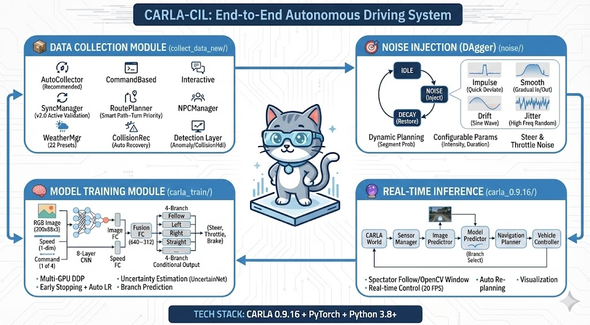

<div align="center">

# CARLA-CIL

基于条件模仿学习的端到端自动驾驶系统



[](https://carla.org/)
[](https://python.org/)
[](https://pytorch.org/)

</div>

## 这是什么

一套完整的 CIL（Conditional Imitation Learning）自动驾驶流水线，从数据收集到模型训练再到实车推理都有。

主要包含四个部分：
- **数据收集** - 在 CARLA 里自动跑车收集训练数据，支持噪声注入（DAgger）
- **模型训练** - 支持多卡 DDP 训练，有早停和学习率调节
- **实时推理** - 加载训练好的模型在 CARLA 里跑
- **导航规划** - 基于 CARLA 的 GlobalRoutePlanner 做路径规划

## 效果演示

### 推理效果

**左转场景**

https://github.com/user-attachments/assets/2b747f1f-049f-4c86-9b5d-d70f5220c136

**右转场景**

https://github.com/user-attachments/assets/79f28b71-d242-4910-922b-048b8a1816fc

**直行场景**

https://github.com/user-attachments/assets/c659094c-47b0-4d47-a513-e5332857a732

### DAgger 噪声注入

车辆会故意偏离车道，然后记录恢复过程，用来增强模型鲁棒性：

https://github.com/user-attachments/assets/2b613e98-06e3-4367-8ff4-cc6aa3442a33

## 项目结构

```
CARLA-CIL/
├── collect_data_new/          # 数据收集（重构版，推荐用这个）
│   ├── collectors/            # 各种收集器
│   ├── core/                  # 核心模块（同步管理、天气、路线规划等）
│   ├── detection/             # 异常检测、碰撞处理
│   ├── noise/                 # 噪声注入
│   ├── utils/                 # 工具类
│   └── scripts/               # 运行脚本
│
├── collect_data_old/          # 数据收集（旧版，功能一样但代码比较乱）
│
├── carla_train/               # 训练代码
│   ├── main_ddp.py            # DDP 训练入口
│   ├── carla_net_ori.py       # 网络定义
│   └── carla_loader_ddp.py    # 数据加载
│
├── carla_0.9.16/              # 推理代码
│   ├── carla_inference.py     # 推理入口
│   └── network/carla_net.py   # 网络结构
│
└── agents/navigation/         # CARLA 导航模块
```

## 网络结构

简单说就是：图像过 CNN 提特征，速度过 FC，两个拼一起，然后根据导航命令选不同的分支输出控制量。

```
RGB Image (200×88×3)
       ↓
   8层 CNN (32→64→128→256)
       ↓
   Image FC (512)
       ↓
       ├──────────────┐
       ↓              ↓
   Fusion FC ← Speed FC (128) ← Speed
       ↓
   ┌───┴───┬───────┬───────┐
   ↓       ↓       ↓       ↓
Follow   Left   Right  Straight  ← 根据 Command 选一个
   └───────┴───────┴───────┘
              ↓
    [Steer, Throttle, Brake]
```

导航命令：`2=Follow | 3=Left | 4=Right | 5=Straight`

## 环境配置

需要的东西：
- CARLA 0.9.16
- Python >= 3.8
- PyTorch 1.x 或 2.x
- NumPy < 2.0（2.0 有兼容问题）
- OpenCV, h5py, NetworkX

```bash
# 装依赖
pip install torch torchvision numpy<2.0 opencv-python h5py networkx shapely tensorboardX

# 装 CARLA Python API
pip install /path/to/CARLA_0.9.16/PythonAPI/carla/dist/carla-0.9.16-py3.x-linux-x86_64.whl
```

## 快速开始

### 1. 启动 CARLA

```bash
# Windows
CarlaUE4.exe -quality-level=Low

# Linux
./CarlaUE4.sh -quality-level=Low
```

### 2. 收集数据

```bash
cd collect_data_new/scripts
python run_auto_collection.py
```

配置文件在 `collect_data_new/config/auto_collection_config.json`，可以改地图、噪声比例这些。

### 3. 训练

```bash
cd carla_train

# 单卡
python main_ddp.py --batch-size 32

# 多卡
bash run_ddp.sh
```

### 4. 推理

```bash
cd carla_0.9.16
python carla_inference.py --model model/your_model.pth --town Town01
```

## 数据收集详细说明

### 配置示例

```json
{
    "carla_settings": {
        "host": "localhost",
        "port": 2000,
        "town": "Town01"
    },
    "route_generation": {
        "strategy": "smart",
        "min_distance": 150.0,
        "max_distance": 400.0,
        "turn_priority_ratio": 0.7
    },
    "noise_settings": {
        "enabled": true,
        "noise_ratio": 0.7,
        "max_steer_offset": 0.5
    }
}
```

### 噪声模式

有四种噪声注入方式：
- **Impulse** - 短促脉冲，模拟突发干扰
- **Smooth** - 平滑偏移，缓入缓出
- **Drift** - 正弦漂移，持续偏移
- **Jitter** - 高频抖动，模拟传感器噪声

### 数据格式

存成 h5 文件，按命令分类：

```
data_cmd{command}_{timestamp}.h5
├── rgb: (N, 200, 88, 3) uint8
└── targets: (N, 4) float32  # [steer, throttle, brake, speed]
```

### 数据工具

```bash
# 验证数据
python verify_data.py --path /path/to/data --min-frames 200

# 可视化
python visualize_data.py --file data.h5

# 数据平衡（转向命令容易不平衡）
python run_balance_selector.py --source /path/to/data --output /path/to/balanced
```

## 新版 vs 旧版

`collect_data_new` 是重构过的版本，主要改进：
- 同步模式管理更稳定，不容易卡死
- 支持 22 种天气预设
- 自动生成数据质量报告
- 资源管理更规范，不会泄漏

旧版 `collect_data_old` 功能一样，但代码组织比较乱，不推荐用了。

## 参考

```bibtex
@inproceedings{codevilla2018end,
  title={End-to-end driving via conditional imitation learning},
  author={Codevilla, Felipe and others},
  booktitle={ICRA},
  year={2018}
}

@inproceedings{dosovitskiy2017carla,
  title={CARLA: An open urban driving simulator},
  author={Dosovitskiy, Alexey and others},
  booktitle={CoRL},
  year={2017}
}
```

## License

MIT
