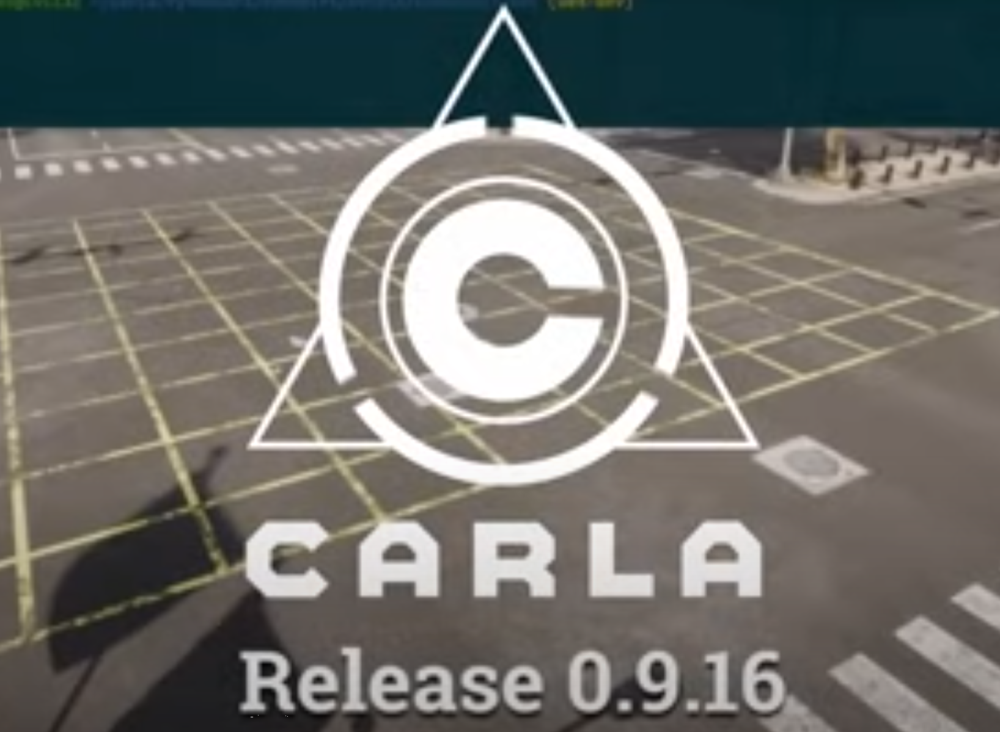
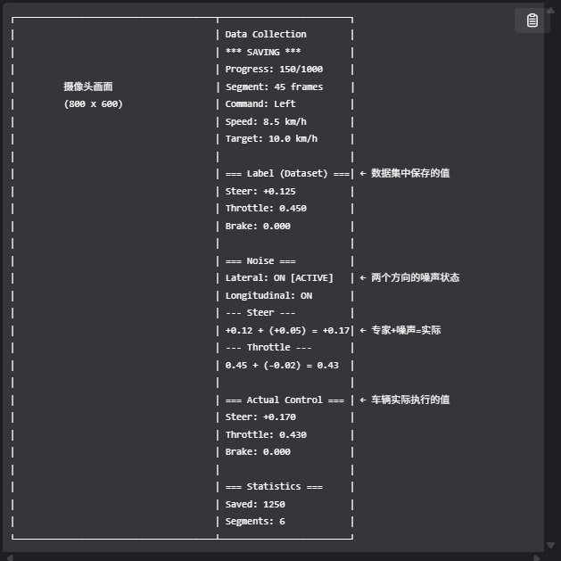

# 🚗 CARLA-CIL

<div align="center">

**基于条件模仿学习的端到端自动驾驶系统**

*End-to-End Autonomous Driving via Conditional Imitation Learning*



<br/>

[](https://carla.org/)
[](https://python.org/)
[](https://pytorch.org/)
[](LICENSE)

[🎬 演示](#-演示) · [⚡ 快速开始](#-快速开始) · [📦 数据收集](#-数据收集) · [🧠 模型训练](#-模型训练) · [🔮 模型推理](#-模型推理)

</div>

---

## 📖 项目简介

本项目实现了完整的 **条件模仿学习（CIL）** 自动驾驶流水线，包含：

| 模块 | 功能 | 特点 |
|:---:|:---|:---|
| 📦 **数据收集** | 全自动驾驶数据采集 | 智能路线规划、碰撞恢复、命令平衡 |
| 🎯 **噪声注入** | DAgger 风格数据增强 | Impulse/Smooth/Drift/Jitter 四种模式 |
| 🧠 **模型训练** | 多 GPU 分布式训练 | DDP 加速、早停机制、自动学习率调节 |
| 🔮 **实时推理** | CARLA 实时自动驾驶 | 导航命令分支预测、可视化界面 |

---

## 🎬 演示

### 模型推理效果

使用训练好的 CIL 模型在 CARLA 中进行实时自动驾驶：

<table>
<tr>
<td align="center" width="33%">

**🔄 左转场景**

https://github.com/user-attachments/assets/2b747f1f-049f-4c86-9b5d-d70f5220c136

[📥 下载视频]击(左转场景.mp4)

</td>
<td align="center" width="33%">

**🔃 右转场景**

https://github.com/user-attachments/assets/79f28b71-d242-4910-922b-048b8a1816fc

[📥 下载视频](右转场景.mp4)

</td>
<td align="center" width="33%">

**⬆️ 直行场景**

https://github.com/user-attachments/assets/c659094c-47b0-4d47-a513-e5332857a732

[📥 下载视频](直行场景.mp4)

</td>
</tr>
</table>

### DAgger 噪声注入数据收集

展示车辆偏离-恢复行为，用于增强模型鲁棒性：

https://github.com/user-attachments/assets/2b613e98-06e3-4367-8ff4-cc6aa3442a33

> 📹 [点击下载完整视频](加噪之后示例视频HD.mp4)

<details>
<summary>📊 数据收集可视化界面</summary>

<p align="center">
  
</p>

显示内容：RGB 图像、导航命令、车辆状态、噪声信息

</details>

---

## 🏗️ 项目结构

```
CARLA-CIL/
│
├── 📦 collect_data_old/              # 数据收集模块
│   ├── auto_full_town_collection.py  # 全自动数据收集器
│   ├── base_collector.py             # 收集器基类
│   ├── noiser.py                     # 噪声注入（4种模式）
│   ├── carla_npc_manager.py          # NPC 车辆/行人管理
│   ├── anomaly_detector.py           # 异常检测（打转/翻车/卡住）
│   ├── verify_collected_data.py      # 数据验证工具
│   ├── visualize_h5_data.py          # 数据可视化工具
│   └── balance_data_selector.py      # 数据平衡工具
│
├── 🧠 carla_train/                   # 模型训练模块
│   ├── main_ddp.py                   # 多 GPU 分布式训练
│   ├── carla_net_ori.py              # CIL 网络定义
│   ├── carla_loader_ddp.py           # 分布式数据加载器
│   └── finetune.py                   # 模型微调
│
├── 🔮 carla_0.9.16/                  # 模型推理模块
│   ├── carla_inference.py            # 主推理脚本
│   ├── network/carla_net.py          # 网络结构
│   ├── carla_model_predictor.py      # 模型预测器
│   ├── carla_image_processor.py      # 图像预处理
│   ├── carla_vehicle_controller.py   # 车辆控制器
│   ├── carla_sensors.py              # 传感器管理
│   ├── carla_visualizer.py           # 可视化工具
│   └── navigation_planner_adapter.py # 导航规划适配器
│
└── 🤖 agents/navigation/             # CARLA 导航代理
    ├── global_route_planner.py       # 全局路径规划
    ├── local_planner.py              # 局部路径规划
    └── basic_agent.py                # 基础导航代理
```

---

## 🧠 网络架构

```
┌────────────────────────────────────────────────────────────────┐
│                     CIL Network Architecture                    │
├────────────────────────────────────────────────────────────────┤
│                                                                 │
│    ┌─────────────┐     ┌─────────────┐     ┌──────────────┐   │
│    │  RGB Image  │     │    Speed    │     │   Command    │   │
│    │  200×88×3   │     │   (1-dim)   │     │   (1 of 4)   │   │
│    └──────┬──────┘     └──────┬──────┘     └──────┬───────┘   │
│           │                   │                   │            │
│           ▼                   │                   │            │
│    ┌──────────────┐           │                   │            │
│    │   8-Layer    │           │                   │            │
│    │     CNN      │           │                   │            │
│    │  32→64→128   │           │                   │            │
│    │    →256      │           │                   │            │
│    └──────┬───────┘           │                   │            │
│           │                   │                   │            │
│           ▼                   ▼                   │            │
│    ┌──────────────┐    ┌──────────────┐          │            │
│    │  Image FC    │    │  Speed FC    │          │            │
│    │   512-dim    │    │   128-dim    │          │            │
│    └──────┬───────┘    └──────┬───────┘          │            │
│           │                   │                   │            │
│           └─────────┬─────────┘                   │            │
│                     ▼                             │            │
│              ┌──────────────┐                     │            │
│              │   Fusion FC  │                     │            │
│              │   640→512    │                     │            │
│              └──────┬───────┘                     │            │
│                     │                             │            │
│     ┌───────────────┼───────────────┐             │            │
│     ▼               ▼               ▼             ▼            │
│ ┌────────┐    ┌────────┐    ┌────────┐    ┌────────┐         │
│ │ Follow │    │  Left  │    │ Right  │    │Straight│ ← Select │
│ │ Branch │    │ Branch │    │ Branch │    │ Branch │          │
│ └───┬────┘    └───┬────┘    └───┬────┘    └───┬────┘         │
│     └─────────────┴─────────────┴─────────────┘               │
│                           │                                    │
│                           ▼                                    │
│              ┌─────────────────────────┐                      │
│              │  [Steer, Throttle, Brake] │                      │
│              └─────────────────────────┘                      │
│                                                                 │
└────────────────────────────────────────────────────────────────┘
```

**导航命令映射：** `2=Follow` | `3=Left` | `4=Right` | `5=Straight`

---

## ⚙️ 环境配置


### 依赖要求

| 依赖 | 版本 | 说明 |
|:---|:---|:---|
| CARLA Simulator | 0.9.16 | 自动驾驶模拟器 |
| Python | ≥ 3.8 | 编程语言 |
| PyTorch | 1.x / 2.x | 深度学习框架 |
| NumPy | < 2.0 | 数值计算 |
| OpenCV | Latest | 图像处理 |
| h5py | Latest | 数据存储 |
| NetworkX | Latest | 路径规划 |

### 安装步骤

```bash
# 1. 克隆仓库
git clone https://github.com/your-username/carla-cil.git
cd carla-cil

# 2. 安装 Python 依赖
pip install torch torchvision numpy<2.0 opencv-python h5py networkx shapely tensorboardX

# 3. 安装 CARLA Python API（根据你的 CARLA 安装路径调整）
pip install /path/to/CARLA_0.9.16/PythonAPI/carla/dist/carla-0.9.16-py3.x-linux-x86_64.whl
```

---

## ⚡ 快速开始

### 1️⃣ 启动 CARLA 服务器

```bash
# Windows
CarlaUE4.exe -quality-level=Low

# Linux
./CarlaUE4.sh -quality-level=Low
```

### 2️⃣ 数据收集

```bash
cd collect_data_old
python auto_full_town_collection.py
```

### 3️⃣ 模型训练

```bash
cd carla_train
# 单 GPU
python main_ddp.py --batch-size 32

# 多 GPU（6卡示例liunx）
bash run_ddp.sh
```

### 4️⃣ 模型推理

```bash
cd carla_0.9.16
python carla_inference.py --model model/your_model.pth --town Town01
```

---

## 📦 数据收集

### 配置文件

编辑 `collect_data_old/auto_collection_config.json`：

```json
{
    "carla_settings": {
        "host": "localhost",
        "port": 2000,
        "town": "Town01"
    },
    "route_generation": {
        "strategy": "smart",
        "min_distance": 150.0,
        "max_distance": 400.0,
        "turn_priority_ratio": 0.7
    },
    "noise_settings": {
        "enabled": true,
        "noise_ratio": 0.7,
        "max_steer_offset": 0.5
    }
}
```

### 噪声注入模式

| 模式 | 描述 | 应用场景 |
|:---:|:---|:---|
| **Impulse** | 短促脉冲，快速上升下降 | 模拟突发干扰 |
| **Smooth** | 平滑偏移，缓入缓出 | 模拟渐进偏离 |
| **Drift** | 正弦波形，缓慢漂移 | 模拟持续偏移 |
| **Jitter** | 高频抖动，随机序列 | 模拟传感器噪声 |

### 数据格式

```
data_cmd{command}_{timestamp}.h5
├── rgb: (N, 200, 88, 3) uint8      # RGB 图像
└── targets: (N, 4) float32         # [steer, throttle, brake, speed]
```

### 数据工具

```bash
# 数据验证
python verify_collected_data.py --path /path/to/data --min-frames 200

# 数据可视化
python visualize_h5_data.py --file data.h5

# 数据平衡 可以多文件夹内进行平衡
python balance_data_selector.py --source /path/to/data --output /path/to/balanced
```

---

## 📚 参考文献

```bibtex
@inproceedings{codevilla2018end,
  title={End-to-end driving via conditional imitation learning},
  author={Codevilla, Felipe and M{\"u}ller, Matthias and L{\'o}pez, Antonio and Koltun, Vladlen and Dosovitskiy, Alexey},
  booktitle={ICRA},
  year={2018}
}

@inproceedings{dosovitskiy2017carla,
  title={CARLA: An open urban driving simulator},
  author={Dosovitskiy, Alexey and Ros, German and Codevilla, Felipe and Lopez, Antonio and Koltun, Vladlen},
  booktitle={CoRL},
  year={2017}
}
```

---

## 📄 License

This project is licensed under the MIT License - see the [LICENSE](LICENSE) file for details.

---

<div align="center">

**Made with ❤️ for autonomous driving research**

[⬆ 返回顶部](#-carla-cil)

</div>
