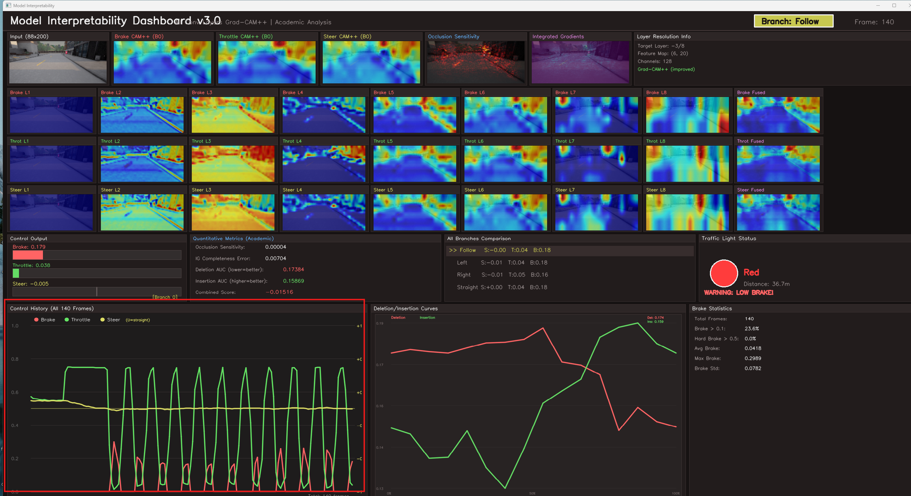
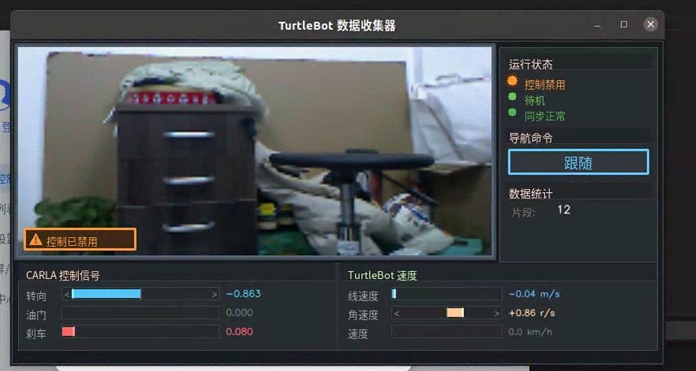

<div align="center">

# CARLA-CIL & TurtleBot

基于条件模仿学习的端到端自动驾驶系统


[](https://carla.org/)
[](https://www.turtlebot.com/)
[](https://python.org/)
[](https://pytorch.org/)

</div>

## 数据集和模型获取

如需训练数据集和推理模型，请添加 QQ：1948627929

## 这是什么

一套完整的 CIL（Conditional Imitation Learning）自动驾驶流水线，支持 **CARLA 仿真** 和 **TurtleBot 实机**。

主要包含两大平台：

### CARLA 仿真平台
- **数据收集** - 在 CARLA 里自动跑车收集训练数据，支持噪声注入（DAgger）
- **模型训练** - 支持多卡 DDP 训练，有早停和学习率调节
- **增量微调** - 支持在已训练模型上微调，防止灾难性遗忘
- **实时推理** - 加载训练好的模型在 CARLA 里跑

### TurtleBot 实机平台
- **数据收集** - 手柄/键盘遥控 TurtleBot 收集数据，格式与 CARLA 兼容
- **模型训练** - 直接预测 linear_vel 和 angular_vel（不需要转换）
- **实时推理** - 在 TurtleBot 上运行端到端自动驾驶

## 效果演示

### CARLA 推理效果（不遵循交通规则）

<table>
<tr>
<td align="center" width="33%">

**左转场景**

https://github.com/user-attachments/assets/2b747f1f-049f-4c86-9b5d-d70f5220c136

</td>
<td align="center" width="33%">

**右转场景**

https://github.com/user-attachments/assets/4d78d485-f5af-4d87-bbc6-5c10774e6bc0

</td>
<td align="center" width="33%">

**直行场景**

https://github.com/user-attachments/assets/c659094c-47b0-4d47-a513-e5332857a732

</td>
</tr>
</table>

### DAgger 噪声注入

车辆会故意偏离车道，然后记录恢复过程，用来增强模型鲁棒性：

https://github.com/user-attachments/assets/2b613e98-06e3-4367-8ff4-cc6aa3442a33

### 红绿灯和车辆遵循 （遵循红绿灯和车辆避障）

https://github.com/user-attachments/assets/51b56508-7ab4-41a9-b756-5c9b33f66a90

### 模型可解释性

<div align="center">

</div>

### TurtleBot 实车数据收集界面

<div align="center">

</div>

## 项目结构

```
CARLA-CIL/
│
├── ==================== CARLA 仿真平台 ====================
│
├── collect_data_new/          # CARLA 数据收集（重构版，推荐）
│   ├── collectors/            # 各种收集器
│   ├── core/                  # 核心模块（同步管理、天气、路线规划等）
│   ├── detection/             # 异常检测、碰撞处理
│   ├── noise/                 # 噪声注入
│   └── scripts/               # 运行脚本
│
├── collect_data_old/          # CARLA 数据收集（旧版）
│
├── carla_train/               # CARLA 训练代码
│   ├── main_ddp.py            # DDP 训练入口
│   ├── carla_net_ori.py       # 网络定义 (输出 steer, throttle, brake)
│   └── carla_loader_*.py      # 数据加载器
│
├── carla_train_traffic/       # 红绿灯场景微调（防遗忘）
│
├── carla_0.9.16/              # CARLA 推理代码
│   ├── carla_inference.py     # 推理入口
│   └── network/               # 网络结构
│
├── ==================== TurtleBot 实机平台 ====================
│
├── turtlebot_collect/         # TurtleBot 数据收集
│   ├── config/                # 配置模块
│   ├── ros_data/              # ROS 数据接口
│   ├── processing/            # 图像处理、控制转换
│   ├── control/               # 手柄/键盘控制器
│   ├── storage/               # H5 数据保存
│   ├── visualization/         # 可视化界面
│   └── collector.py           # 主收集器
│
├── turtlebot_train/           # TurtleBot 训练代码
│   ├── main_ddp.py            # DDP 训练入口
│   ├── turtlebot_net_ori.py   # 网络定义 (输出 linear_vel, angular_vel)
│   ├── turtlebot_loader_*.py  # 数据加载器
│   └── run_ddp_dynamic.sh     # 训练启动脚本
│
├── turtlebot_inference/       # TurtleBot 推理代码
│   ├── turtlebot_inference.py # 推理入口
│   └── model/                 # 模型加载和预测
│
└── agents/navigation/         # CARLA 导航模块
```

## 网络结构

### CARLA 网络 (输出 3 维)

```
RGB Image (200×88×3)
       ↓
   8层 CNN (32→64→128→256)
       ↓
   Image FC (512)
       ↓
       ├──────────────┐
       ↓              ↓
   Fusion FC ← Speed FC (128) ← Speed
       ↓
   ┌───┴───┬───────┬───────┐
   ↓       ↓       ↓       ↓
Follow   Left   Right  Straight  ← 根据 Command 选一个
   └───────┴───────┴───────┘
              ↓
    [Steer, Throttle, Brake]  ← 3 维输出
```

### TurtleBot 网络 (输出 2 维)

```
RGB Image (200×88×3)
       ↓
   8层 CNN (32→64→128→256)
       ↓
   Image FC (512)
       ↓
       ├──────────────┐
       ↓              ↓
   Fusion FC ← Speed FC (128) ← Speed
       ↓
   ┌───┴───┬───────┬───────┐
   ↓       ↓       ↓       ↓
Follow   Left   Right  Straight  ← 根据 Command 选一个
   └───────┴───────┴───────┘
              ↓
    [Linear_vel, Angular_vel]  ← 2 维输出
```

导航命令：`2=Follow | 3=Left | 4=Right | 5=Straight`

## 数据格式对比

| 项目 | CARLA | TurtleBot |
|------|-------|-----------|
| 图像尺寸 | (88, 200, 3) | (88, 200, 3) |
| 控制输出 | steer, throttle, brake | linear_vel, angular_vel |
| 输出维度 | 4×3 = 12 | 4×2 = 8 |
| targets 索引 | [0:3] | [20:22] |
| 速度索引 | [10] | [10] |
| 命令索引 | [24] | [24] |

```python
# H5 文件结构 (两个平台通用)
{
    'rgb': (N, 88, 200, 3),      # 图像数据
    'targets': (N, 25),          # 控制信号
}

# CARLA targets
targets[0]  = steer         # 方向 (-1 ~ 1)
targets[1]  = throttle      # 油门 (0 ~ 1)
targets[2]  = brake         # 刹车 (0 ~ 1)
targets[10] = speed         # 速度 (km/h)
targets[24] = command       # 导航命令 (2/3/4/5)

# TurtleBot targets (额外字段)
targets[20] = linear_vel    # 线速度 (m/s)
targets[21] = angular_vel   # 角速度 (rad/s)
```

## 环境配置

### CARLA 环境

```bash
# 装依赖
pip install torch torchvision numpy<2.0 opencv-python h5py networkx shapely tensorboardX

# 装 CARLA Python API
pip install /path/to/CARLA_0.9.16/PythonAPI/carla/dist/carla-0.9.16-py3.x-linux-x86_64.whl
```

### TurtleBot 环境

```bash
# ROS 依赖
sudo apt install ros-noetic-cv-bridge ros-noetic-sensor-msgs ros-noetic-nav-msgs

# Python 依赖
pip install torch torchvision opencv-python h5py imgaug
```

## 快速开始

### CARLA 流程

```bash
# 1. 启动 CARLA
CarlaUE4.exe -quality-level=Low  # Windows
./CarlaUE4.sh -quality-level=Low  # Linux

# 2. 收集数据
cd collect_data_new/scripts
python run_auto_collection.py

# 3. 训练
cd carla_train
bash run_ddp.sh

# 4. 推理
cd carla_0.9.16
python carla_inference.py --model model/your_model.pth --town Town01
```

### TurtleBot 流程

```bash
# 1. 启动 TurtleBot
roslaunch turtlebot_bringup minimal.launch
roslaunch turtlebot_bringup 3dsensor.launch
rosrun joy joy_node

# 2. 收集数据
cd turtlebot_collect
python collector.py --output ./data --rate 10 --frames 200

# 3. 训练
cd turtlebot_train
bash run_ddp_dynamic.sh

# 4. 推理
cd turtlebot_inference
python run_turtlebot_inference.py --model model/your_model.pth
```

## TurtleBot 详细说明

### 数据收集

```bash
# 默认配置
python collector.py

# 自定义配置
python collector.py \
    --output ./my_data \
    --rate 15 \
    --frames 100 \
    --model burger \
    --joystick ps4
```

手柄按键映射 (Xbox):
| 按键 | 功能 |
|------|------|
| 左摇杆 Y轴 | 前进/后退 |
| 右摇杆 X轴 | 左转/右转 |
| Start | 开始录制 |
| Back | 停止录制 |
| Y/X/B/A | Follow/Left/Right/Straight |

### 训练

```bash
cd turtlebot_train

# 动态帧数版本（推荐）
bash run_ddp_dynamic.sh

# 或手动指定参数
torchrun --nproc_per_node=6 main_ddp.py \
    --batch-size 1536 \
    --lr 1e-4 \
    --epochs 90 \
    --dynamic-loader \
    --min-frames 10
```

### 推理

```python
from turtlebot_net_ori import FinalNet
import torch

# 加载模型
model = FinalNet(structure=1)
model.load_state_dict(torch.load('model.pth')['state_dict'])
model.eval()

# 推理
with torch.no_grad():
    pred_control, pred_speed = model(img, speed)

# 根据命令选择分支并反归一化
branch_idx = command - 2
linear_vel = pred_control[0, branch_idx*2].item() * 0.7      # MAX_LINEAR_VEL
angular_vel = pred_control[0, branch_idx*2+1].item() * 1.0   # MAX_ANGULAR_VEL
```

### TurtleBot 型号参数

| 型号 | max_linear (m/s) | max_angular (rad/s) |
|------|------------------|---------------------|
| turtlebot2 / kobuki | 0.7 | 1.0 |
| burger | 0.22 | 2.84 |
| waffle | 0.26 | 1.82 |

## CARLA 详细说明

### 数据收集配置

```json
{
    "carla_settings": {
        "host": "localhost",
        "port": 2000,
        "town": "Town01"
    },
    "route_generation": {
        "strategy": "smart",
        "min_distance": 150.0,
        "max_distance": 400.0,
        "turn_priority_ratio": 0.7
    },
    "noise_settings": {
        "enabled": true,
        "noise_ratio": 0.7,
        "max_steer_offset": 0.5
    }
}
```

### 噪声模式

- **Impulse** - 短促脉冲，模拟突发干扰
- **Smooth** - 平滑偏移，缓入缓出
- **Drift** - 正弦漂移，持续偏移
- **Jitter** - 高频抖动，模拟传感器噪声

### 增量微调（防遗忘）

```bash
cd carla_train_traffic
bash run_finetune.sh
```

关键参数：
- `--mix-ratio 0.3` - 新数据占 30%，旧数据占 70%
- `--distill-alpha 0.3` - 30% 损失来自知识蒸馏
- `--ewc-lambda 5000` - EWC 正则化强度

## 常见问题

### Q: h5 文件帧数不一致怎么办？
A: 使用 `--dynamic-loader` 参数，会自动检测每个文件的帧��。

### Q: TurtleBot 和 CARLA 的模型能通用吗？
A: 不能直接通用。CARLA 输出 3 维 (steer, throttle, brake)，TurtleBot 输出 2 维 (linear_vel, angular_vel)。但网络结构相同，可以迁移学习。

### Q: 训练时显存不够？
A: 减小 `--batch-size`，或使用 `--use-amp` 开启混合精度。

### Q: TurtleBot 数据收集时图像不同步？
A: 使用 `--no-sync` 禁用传感器同步，或调整 `MAX_SENSOR_TIME_DIFF` 阈值。

## 参考

```bibtex
@inproceedings{codevilla2018end,
  title={End-to-end driving via conditional imitation learning},
  author={Codevilla, Felipe and others},
  booktitle={ICRA},
  year={2018}
}

@inproceedings{dosovitskiy2017carla,
  title={CARLA: An open urban driving simulator},
  author={Dosovitskiy, Alexey and others},
  booktitle={CoRL},
  year={2017}
}
```

## License

MIT
